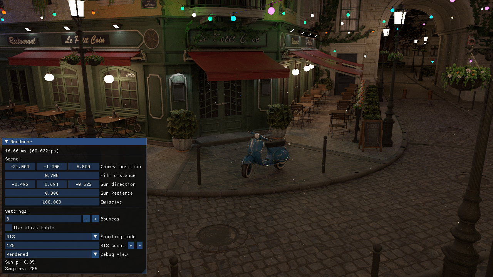

# DXRust

A work in progress path tracer written in Rust using hardware accelerated raytracing through DXR.



## Features
- DX12 and Win32 platform layers written from scratch
- Rasterization pipeline developed in parallel for comparison and debugging
- Vector math library
- GLTF 3D models and texture loading + custom asset file format for faster load times
- Path tracer integrator with area light and BRDF multiple importance sampling
- Alias tables for fast light importance sampling based on emitted radiance and area
- Next event estimation with Resampled Importance Sampling (RIS) with weighted reservoir sampling (WRS)
- ImGui integration

## Todo
- Spatio-Temporal reuse (ReSTIR)
- Environment lights
- Denoising
- Shader hot reloading
- Much, much more...

## Build
Currently HLSL shaders are compiled to bytecode and included directly in the program executable as binary data.
A python script is used to build the shader binaries and generate the required rust code, a recent version of the [DXC compiler](https://github.com/microsoft/DirectXShaderCompiler/releases) `dxc` must be in the path when running the script or the `DXC` variable in the script must be updated to point to the executable. Additionally structs shared between HLSL
and Rust code are automatically translated by parsing HLSL files using the `pycparse` libary which can be installed with:
```
pip install pycparser
```
The library invokes a C preprocessor (`clang-cpp` by default) as specified in the `CPP_PATH` variable in the script. If `clang-cpp` is not in the path this variable must be updated to point to some C preprocessor.

```
git clone --recursive https://github.com/ramenguy99/DXRust

cd DXRust

# Make sure dxc.exe and clang-cpp.exe are in the path or update the DXC and CPP_PATH variables
python shaders.py

cargo run --release PATH
```

The binary takes as first and only argument a path to a serialized scene compressed with LZ4. Compressed scenes can be created using the `asset` crate in `crates/asset` from GLTF files, currently this is not a very robust importer and supports only a specific subset of GLTF files.